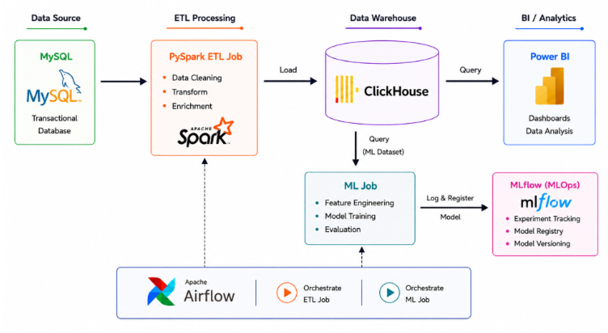

# Hospital ETL Pipeline

A comprehensive end-to-end ETL (Extract, Transform, Load) and MLOps pipeline designed for hospital data integration, warehousing, and predictive analytics. 

This project extracts operational database (OLTP) logs from **MySQL**, ingests and processes data through a multi-layered Data Lake (**HDFS**) using **Apache Spark (PySpark)** under the **Medallion Architecture**, loads cleansed and structured dimensional data into a **ClickHouse Cloud/Local Data Warehouse**, and automates predictive time-series forecasting (SARIMA) tracked via **MLflow**.



---

## 🏗 Project Directory Structure

```text
Hospital_ETL/
├── dags/                           # Airflow DAGs orchestrating the ETL pipeline
│   └── hospital_etl_dag.py         # Main DAG definition file
├── datasource/                     # Sample OLTP data scripts (.sql) for auto-initializing MySQL
├── docs/                           # Detailed business and technical documentation
│   └── ETL_BUSINESS_LOGIC.md       # Technical explanation of the ETL logic & Medallion layers
├── scripts_final/                  # Core PySpark ETL and MLOps scripts
│   ├── extract_mysql_to_hdfs.py    # Job 1: Ingest MySQL raw data into HDFS (Bronze layer)
│   ├── hospital_staging_job.py     # Job 2: Cleanse, map schemas, and output to HDFS (Silver layer)
│   ├── hospital_dimension_job.py   # Job 3: Generate Dimension Tables with Surrogate Keys (Gold layer)
│   ├── hospital_fact_job.py        # Job 4: Create Fact Tables and isolate dirty data (Gold layer)
│   ├── load_hdfs_to_clickhouse_dw.py # Job 5: Load Gold tables into ClickHouse Data Warehouse via JDBC
│   ├── train_forecast_models.py    # Job 6 (MLOps): Train SARIMA time-series models for revenue & user forecasting
│   └── hospital_utils.py           # Shared helper functions (SparkSession setup, read/write utilities)
├── shell/                          # Bash scripts used by Airflow to submit Spark jobs
│   └── hospital_etl_airflow.sh     # Spark job submission and orchestration helper
├── sql tạo bảng/                   # SQL dump files for ClickHouse schemas and structures
├── Dockerfile.airflow              # Customized Airflow Docker image pre-configured with Docker CLI
├── docker-compose.yml              # Central compose file linking all subsystem compose files using 'include'
├── docker-compose.data.yml         # Compose configuration for databases (MySQL, ClickHouse)
├── docker-compose.hdfs.yml         # Compose configuration for the HDFS cluster (NameNode, DataNode)
├── docker-compose.spark.yml        # Compose configuration for Apache Spark (Master, Worker)
├── docker-compose.airflow.yml      # Compose configuration for Apache Airflow (Webserver, Scheduler, Postgres backend)
├── docker-compose.mlops.yml        # Compose configuration for MLflow tracking server
├── clickhouse_schema.sql           # Schema definition script for ClickHouse tables
└── requirements.txt                # Python libraries required for Spark and local tasks
```

---

## 🛠 System Requirements
*   **Docker** & **Docker Compose** (V2.20+ is recommended as the architecture uses the compose `include` feature).
*   Stable network connection (especially if connecting to ClickHouse Cloud; otherwise, a local ClickHouse container is automatically spun up).

---

## 🚀 Setup & Execution Guide

### Step 1: Spin up the Infrastructure
The entire big data infrastructure (HDFS, Apache Spark, Airflow, MLflow, MySQL, Postgres, ClickHouse) is fully containerized.

From the root directory of the project (`Hospital_ETL`), execute the following command in your terminal:
```bash
docker compose up --build -d
```
*Note:* The `--build` flag builds the customized Airflow image (using `Dockerfile.airflow`) containing the Docker CLI. This allows Airflow to manage Spark jobs seamlessly. Subsequent runs will start up in under 5 seconds.

### Step 2: Source Data Auto-Initialization
When the MySQL container starts up for the first time, it automatically reads the SQL dumps inside the `./datasource` directory and populates the source database (`hospital_source`). You do not need to execute any manual scripts to load the initial sample data.

*(Note: If you ever want to reset the databases to their initial clean state, run `docker compose down -v` to delete the persisted Docker volumes, and then start the infrastructure up again).*

### Step 3: Run and Monitor the Pipeline via Airflow
1. Open your web browser and navigate to the Airflow Web UI:
   👉 **[http://localhost:8082](http://localhost:8082)**
2. Log in using the default administrator credentials:
   *   **Username:** `admin`
   *   **Password:** `admin`
3. Locate the DAG named `hospital_etl_dag` and toggle the switch to **On**.
4. Click the **Play** button (Trigger DAG) to run the pipeline.
5. Airflow will execute the tasks sequentially:
   `extract_mysql_to_hdfs` ➔ `build_staging` ➔ `build_dimensions` ➔ `build_facts` ➔ `load_hdfs_to_clickhouse_dw` ➔ `train_ml_forecast_models`.

---

## 🖥 Service Web Interfaces (Web UIs)

Once the infrastructure is up, you can access and monitor various components at these ports:

| Service | Port | Web UI URL | Description |
| :--- | :--- | :--- | :--- |
| **Apache Airflow** | `8082` | **[http://localhost:8082](http://localhost:8082)** | Orchestrates and schedules the ETL DAG runs (admin/admin). |
| **MLflow Server** | `5000` | **[http://localhost:5000](http://localhost:5000)** | Tracks model runs, metrics (MAE, RMSE), plots, and stores the champion forecasting model. |
| **HDFS NameNode** | `9870` | **[http://localhost:9870](http://localhost:9870)** | Explores Bronze, Silver, Gold, and Quarantine layers in the Hadoop Distributed File System. |
| **Spark Master** | `8083` | **[http://localhost:8083](http://localhost:8083)** | Monitors active Spark applications, executors, and processing logs. |
| **Spark Worker** | `8081` | **[http://localhost:8081](http://localhost:8081)** | Spark worker dashboard monitoring resources and executors allocation. |
| **ClickHouse HTTP** | `8123` | **[http://localhost:8123](http://localhost:8123)** | Port for HTTP queries, API connections (clickhouse-connect), and third-party dashboard integrations. |

---

## ⚙️ Configuration
System configurations and connection parameters are managed dynamically.

1. **Environment Variables (`.env`):**
   Create a `.env` file in the root directory to customize database credentials, hostnames, and ports. If not provided, fallback parameters defined in individual compose files and `hospital_utils.py` will be used:
   - `MYSQL_ROOT_PASSWORD` (Default: `rootpassword`)
   - `CLICKHOUSE_HOST` (Default: `clickhouse` - internal Docker container name, or a ClickHouse Cloud host)
   - `CLICKHOUSE_PORT` (Default: `8123`)
   - `CLICKHOUSE_USER` (Default: `default`)
   - `CLICKHOUSE_PASSWORD` (Default: `""`)
   - `MLFLOW_TRACKING_URI` (Default: `http://mlflow-server:5000`)

2. **ClickHouse Connections (`hospital_utils.py`):**
   The JDBC and HTTP URL connections are resolved programmatically in `hospital_utils.py` using host environment settings, allowing the same codebase to run in both Docker-isolated networks and external cloud environments.
