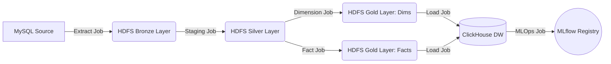

# Tài liệu Nghiệp vụ ETL (ETL Business Logic)

Dự án Hospital ETL áp dụng kiến trúc **Medallion Architecture** (Bronze ➔ Silver ➔ Gold) kết hợp với mô hình **Star Schema** dành cho Data Warehouse để phục vụ báo cáo BI (Business Intelligence). Dưới đây là mô tả chi tiết quy trình luân chuyển và xử lý dữ liệu qua từng bước (Jobs).

---

## Tổng quan Kiến trúc

Quá trình chia làm 5 Job Spark tách biệt, được điều phối tuần tự qua Airflow.

---

## Chi tiết từng tiến trình (ETL Jobs)

### 1. Job Extract (Raw Data Ingestion)
**Script:** `extract_mysql_to_hdfs.py`
- **Nhiệm vụ:** Đọc toàn bộ các bảng dữ liệu hoạt động (OLTP) từ MySQL và ghi thẳng xuống HDFS dưới định dạng Parquet (Tầng Bronze).
- **Nghiệp vụ:** 
  - Đóng vai trò là "Data Lake / Raw Storage". Không có bất kỳ thay đổi nào về cấu trúc hoặc giá trị dữ liệu ở tầng này để đảm bảo có thể trace-back (truy vết) lại nguồn gốc dữ liệu ban đầu nếu hệ thống xảy ra lỗi.
  - Phân vùng dữ liệu (Partitioning) theo `run_date` trên HDFS để dễ dàng quản lý theo ngày.

### 2. Job Staging (Làm sạch & Chuẩn hóa dữ liệu)
**Script:** `hospital_staging_job.py`
- **Nhiệm vụ:** Đọc dữ liệu từ tầng Bronze, làm sạch, đổi tên cột (Aliasing) và ghi ra tầng Silver.
- **Nghiệp vụ:**
  - **Đồng nhất tên cột (Column Aliasing):** Do nguồn dữ liệu ban đầu thường lộn xộn (ví dụ: `p_id`, `patient_no`, `PatientCode` đều chỉ chung một thứ), luồng này sẽ dùng dictionary map lại toàn bộ để có tên cột chuẩn, dùng ngôn ngữ tiếng Anh và quy tắc CamelCase.
  - **Ép kiểu & Parse Date:** Xử lý các cột DateTime dưới dạng String lộn xộn thành kiểu `TIMESTAMP` hoặc `DATE` chuẩn.
  - **Làm sạch (Data Cleansing):** 
    - Lọc bỏ các dòng Rác, Thiếu Key (ví dụ Bệnh nhân không có mã PatientCode).
    - Tính toán thêm một số Field phái sinh (Derived fields) cơ bản: Tính `WaitingMinutes` (Thời gian chờ = Start Consultation - Checkin Time).
  - Dữ liệu hoàn thiện được lưu bằng định dạng Parquet siêu nhẹ, sẵn sàng cho việc Join dữ liệu.

### 3. Job Dimension (Xây dựng Bảng Danh mục)
**Script:** `hospital_dimension_job.py`
- **Nhiệm vụ:** Trích xuất các thực thể (Entity) từ tầng Silver để tạo thành các bảng Dimension (Dim) độc lập. 
- **Nghiệp vụ:**
  - **Xóa trùng lặp (Deduplication):** Sử dụng hàm Window (`ROW_NUMBER() OVER (PARTITION BY Code ORDER BY updated_at DESC)`) để chỉ lấy dòng mới nhất (Latest State) của mỗi một đối tượng (Bác sĩ, Dịch vụ, Khoa phòng...). Điều này tương đương cấu hình SCD Type 1 (Ghi đè bản ghi cũ).
  - **Sinh khóa nhân tạo (Surrogate Key):** Rất quan trọng trong Data Warehouse. Sử dụng `monotonically_increasing_id()` phân tán cực nhanh của Spark để gán ID đại diện (kiểu số Integer) cho từng đối tượng thay vì dùng mã chuỗi ký tự String, giúp việc truy vấn trên ClickHouse tăng tốc gấp bội.
  - Các bảng sinh ra: `Dim_Patient`, `Dim_Doctor`, `Dim_Service`, `Dim_Medicine`, `Dim_Department`, `Dim_Insurance`, `Dim_Date`.

### 4. Job Fact (Xây dựng Bảng Sự kiện & Xử lý Chất lượng)
**Script:** `hospital_fact_job.py`
- **Nhiệm vụ:** Gắn Surrogate Keys vào các giao dịch phát sinh và tính toán Metrics (Doanh thu, Chi phí, Đếm số lượng).
- **Nghiệp vụ:**
  - Đọc dữ liệu giao dịch ở Silver (Visit, Prescription, Service Transaction) và **INNER JOIN** với các bảng Dim ở Gold để ánh xạ (Mapping) mã Natural Key sang Surrogate Key.
  - **Tính toán tài chính (Business Metrics):**
    - `InsurancePaidAmount` = Giá tiền x Số lượng x (Tỷ lệ chi trả / 100).
    - `PatientPaidAmount` = Tổng tiền - Tiền bảo hiểm trả.
  - **Quarantine (Cách ly dữ liệu bẩn):** Job sẽ chạy `LEFT JOIN` và tìm ra các trường hợp "Orphan Records" (Ví dụ: Một lượt khám gắn cho bác sĩ có mã `DOC099`, nhưng không tồn tại bác sĩ `DOC099` trong Dim_Doctor). Các bản ghi rác này bị cách ly ra thư mục `/quarantine/` trên HDFS để Data Engineer phân tích lỗi hệ thống nguồn. 
  - Các bảng sinh ra: `Fact_Visit`, `Fact_ServiceRevenue`, `Fact_Prescription`.

### 5. Job Load (Đẩy lên Data Warehouse)
**Script:** `load_hdfs_to_clickhouse_dw.py`
- **Nhiệm vụ:** Khởi tạo bảng bên ClickHouse và đẩy dữ liệu tầng Gold (Parquet) lên.
- **Nghiệp vụ:**
  - **Thiết kế Bảng (Schema Definition):** Khởi tạo trước các bảng ClickHouse thông qua HTTP API bằng cơ chế Table Engine `ReplacingMergeTree`.
  - **Cơ chế Upsert (Incremental):** `ReplacingMergeTree` tự động dò quét và Ghi đè (Upsert) dữ liệu mới đè lên dữ liệu cũ dựa vào cấu hình `ORDER BY (Khóa chính)`. Tránh hiện tượng đúp số liệu nếu Job ETL lỡ bị chạy đè 2 lần một ngày, loại bỏ hoàn toàn cơ chế Truncate (Xóa trắng bảng) tốn kém.
  - **Truyền dẫn dữ liệu:** Sử dụng JDBC Push Batch qua Spark để đẩy hàng triệu dòng dữ liệu lên hệ thống ClickHouse Cloud một cách ổn định, tự động parse chuẩn mọi loại Data Types nhờ thừa hưởng từ cấu trúc của Parquet file.

### 6. Job MLOps (Dự báo doanh thu)
**Script:** `train_revenue_forecast.py`
- **Nhiệm vụ:** Lấy dữ liệu từ ClickHouse DW, huấn luyện mô hình dự báo chuỗi thời gian (ARIMA) và tự động quản lý version mô hình qua công cụ MLflow.
- **Nghiệp vụ:**
  - **Dự báo:** Lấy tổng doanh thu từ bảng `fact_service_revenue` theo từng ngày. Chia tập Train/Test (30 ngày) và áp dụng mô hình ARIMA để dự báo doanh thu 30 ngày tiếp theo.
  - **CI/CD Mô hình (Model Registry):** Tính toán độ chính xác (MAE, RMSE) của mô hình vừa train. Tự động so sánh với mô hình "Champion" đang được lưu trữ trên MLflow Registry. Nếu mô hình mới tốt hơn (sai số nhỏ hơn), hệ thống sẽ tự động đăng ký mô hình, tạo Schema (Signature) tự động, gắn kèm Description nghiệp vụ, và đánh dấu mác (alias) `champion` cho phiên bản mới.
