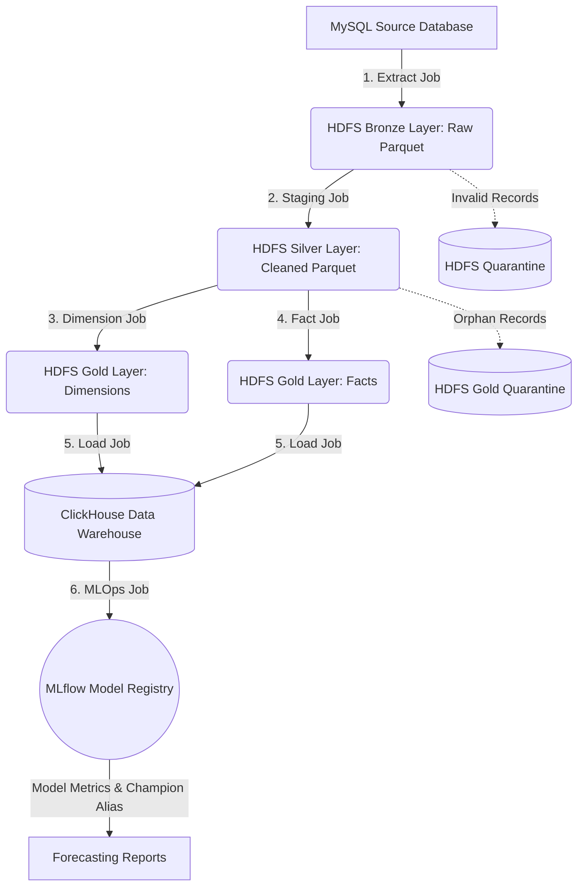

# ETL Business Logic and Technical Architecture

The Hospital ETL project implements a modern **Medallion Architecture** (Bronze ➔ Silver ➔ Gold) coupled with a **Star Schema** data warehouse model to support downstream BI (Business Intelligence) reporting and advanced predictive analytics. 

This document provides a comprehensive technical overview of the data lifecycle, schema design, cleansing rules, and analytical stages.

---

## Technical Architecture Overview

The pipeline is split into **6 isolated Spark/Python jobs**, scheduled and orchestrated sequentially via Apache Airflow.

---

## ETL Processing Layers & Jobs

### 1. Extract Job (Raw Data Ingestion)
*   **Script:** [extract_mysql_to_hdfs.py](file:///f:/Hospital_ETL/scripts_final/extract_mysql_to_hdfs.py)
*   **Source:** MySQL OLTP Database (`hospital_source`)
*   **Destination:** HDFS Bronze Layer (`/hospital_etl/bronze/run_date={run_date}`)
*   **Business Logic & Rules:**
    *   Acts as the **Raw Storage / Landing Zone**.
    *   Extracts 9 tables representing hospital entities: `patients`, `doctors`, `departments`, `services`, `medicines`, `insurance`, `visits`, `service_transactions`, and `prescriptions`.
    *   No structural changes or data transformations are applied at this stage. This preserves full lineage and allows auditability/reprocessing from raw data in the event of pipeline failures.
    *   Data is written in compressed Parquet format and partitioned by execution day (`run_date`) for query optimization.

### 2. Staging Job (Data Cleansing & Standardization)
*   **Script:** [hospital_staging_job.py](file:///f:/Hospital_ETL/scripts_final/hospital_staging_job.py)
*   **Source:** HDFS Bronze Layer
*   **Destination:** HDFS Silver Layer (`/hospital_etl/silver/run_date={run_date}`)
*   **Business Logic & Rules:**
    *   **Flexible Column Mapping:** Maps source columns that contain symbols, spaces, or casing issues (e.g., `PatientId`, `PatientCode`, `PatientNo`) to standardized English camel-case schemas (`PatientCode`, `FullName`, `Gender`, etc.) using regex normalization.
    *   **Master Data Cleansing:**
        *   *Gender:* Standardized into `Nam` (Male), `Nữ` (Female), `Khác` (Other), or `Không xác định` (Unknown).
        *   *BirthYear & AgeGroup:* Birth years are validated between 1900 and the current year. If valid, patients are assigned to age brackets: `0-17`, `18-35`, `36-55`, or `56+`.
        *   *City:* Text entries are standardized to major Vietnamese cities (e.g. `Hà Nội`, `TP. Hồ Chí Minh`, `Đà Nẵng`) to fix typographical variations.
        *   *Specialty & Academic Title:* Cleanses hospital-specific titles (e.g., mapping `bs` ➔ `BS`, `thac si` ➔ `ThS`) and specialty strings.
        *   *Insurance & Coverage Rate:* Standardizes coverage percentages (0 to 100) and formats description labels (e.g., `BHYT 80%` or `Tự chi trả` if coverage rate is 0).
    *   **Financial Curing:** Cleanse financial strings containing currency notations (like `VND`, commas, or spaces) and convert them to SQL `DECIMAL(18,2)`.
    *   **Derived Columns:** Calculates `WaitingMinutes` as the elapsed time in minutes between check-in and the beginning of the consultation (`ConsultationStartTime - CheckinTime`).
    *   **Quarantine Partitioning:** Invalid records (e.g., records missing primary keys like `PatientCode`, visits that are not marked as `COMPLETED`, transactions with quantities $\le 0$ or unit prices $\le 0$, or unpaid transactions) are filtered out and written to `/hospital_etl/quarantine/` on HDFS for monitoring.
    *   Cleansed data is written as Parquet ready for dimension/fact generation.

### 3. Dimension Job (SCD Type 1 & Surrogate Key Generation)
*   **Script:** [hospital_dimension_job.py](file:///f:/Hospital_ETL/scripts_final/hospital_dimension_job.py)
*   **Source:** HDFS Silver Layer
*   **Destination:** HDFS Gold Layer (`/hospital_etl/gold/run_date={run_date}/Dim_*`)
*   **Business Logic & Rules:**
    *   **Deduplication (SCD Type 1):** Applies windowing partitions (`ROW_NUMBER() OVER (PARTITION BY NaturalKey ORDER BY updated_at DESC, id DESC)`) to extract only the latest state of each master entity (Patients, Doctors, Services, Departments, Medicines, Insurance types). Historical updates overwrite previous entries (Slowly Changing Dimension Type 1).
    *   **Surrogate Keys (SK):** Generates numerical identifiers using PySpark's distributed `monotonically_increasing_id()` function. Replacing string codes with integer SK keys significantly speeds up joins and aggregation speeds in ClickHouse.
    *   **Automated Date Dimension (`Dim_Date`):** Collects all transaction dates from staging tables, dedupes them, and extracts calendar properties like: `DateKey` (YYYYMMDD integer), `FullDate` (Date), `DayNumber`, `MonthNumber`, `MonthName` (e.g. "January"), `QuarterNumber`, `YearNumber`, `DayOfWeekNumber`, `DayOfWeekName` (e.g. "Monday"), and an `IsWeekend` flag.

### 4. Fact Job (Surrogate Key Mapping & Referral Integrity)
*   **Script:** [hospital_fact_job.py](file:///f:/Hospital_ETL/scripts_final/hospital_fact_job.py)
*   **Source:** HDFS Silver Layer (Transactions) & HDFS Gold Layer (Dimensions)
*   **Destination:** HDFS Gold Layer (`/hospital_etl/gold/run_date={run_date}/Fact_*`)
*   **Business Logic & Rules:**
    *   **SK Joining:** Joins staging transactional tables (`visits`, `service_transactions`, `prescriptions`) with Gold Dimension tables on their natural keys to map them into their corresponding integer surrogate keys (`PatientKey`, `DoctorKey`, `ServiceKey`, etc.).
    *   **Referral Integrity (Orphan Record Identification):** Identifies transaction records containing codes that do not exist in the dimension catalog (e.g., a visit referring to a non-existent doctor code `DOC999`). These records are isolated to `/hospital_etl/quarantine/` under fact-specific labels (e.g. `fact_visit_missing_dimension`) for Data Quality audits.
    *   **Financial Calculation:**
        *   `InsurancePaidAmount` = Total Amount $\times$ (Insurance Coverage Rate / 100)
        *   `PatientPaidAmount` = Total Amount $-$ Insurance Paid Amount
    *   **Fact Output Tables:**
        *   `Fact_Visit`: Captures consultation fees, waiting times, and visit counts (`VisitCount = 1`).
        *   `Fact_ServiceRevenue`: Captures details of hospital services ordered, unit prices, total cost, insurance paid, and patient paid.
        *   `Fact_Prescription`: Records medication prescriptions dispensed, quantity, cost, insurance paid, and patient paid.

### 5. Load Job (ClickHouse Data Warehouse Feeding)
*   **Script:** [load_hdfs_to_clickhouse_dw.py](file:///f:/Hospital_ETL/scripts_final/load_hdfs_to_clickhouse_dw.py)
*   **Source:** HDFS Gold Layer (Parquet format)
*   **Destination:** ClickHouse Cloud/Local Data Warehouse (`hospital_dw` database)
*   **Business Logic & Rules:**
    *   **DDL Initializer:** Uses the ClickHouse HTTP API to issue `CREATE DATABASE` and `CREATE TABLE` commands. 
    *   **ReplacingMergeTree Engine:** Every table in the warehouse is defined using ClickHouse's `ReplacingMergeTree` engine, ordered by its primary key (e.g. `VisitCode` for visits, `DateKey` for dates). This engine automatically handles duplicates during merges by overwriting older entries with the newest run date. This eliminates the need for expensive `TRUNCATE` operations and prevents double-counting if the ETL pipeline is run multiple times.
    *   **JDBC Ingestion:** Reads Gold Parquet schemas and bulk-inserts them into ClickHouse tables in batches of **10,000** records to maximize ingestion throughput.

### 6. MLOps Job (Predictive Analytics & Model CI/CD)
*   **Script:** [train_forecast_models.py](file:///f:/Hospital_ETL/scripts_final/train_forecast_models.py)
*   **Source:** ClickHouse Data Warehouse Tables
*   **Infrastructure:** MLflow Tracking Server (`http://mlflow-server:5000`)
*   **Business Logic & Rules:**
    *   **Data Aggregation:** Retrieves historical daily service revenue and daily unique patient counts from `fact_service_revenue`.
    *   **Parallel Execution:** Spins up a `ProcessPoolExecutor` to train two separate forecasting models concurrently:
        1. **Revenue Forecast Model**
        2. **User Count Forecast Model**
    *   **Grid Search & Hyperparameter Tuning:**
        *   Performs a grid search sweep across SARIMA orders: non-seasonal `(p, d, q)` and seasonal `(P, D, Q, s=7)` parameters.
        *   Splits historical data into Train, Validation (15 days), and Test (15 days) sets.
        *   Finds the configuration that yields the lowest **Validation MAE** (Mean Absolute Error).
    *   **Model Re-fitting & Prediction:** Re-fits the model using the optimal parameters over the joint (Train + Validation) set, predicts the Test set, and forecasts 30 days into the future.
    *   **MLflow Logging:** Logs tuning parameters, evaluation metrics (MAE, RMSE), time-series prediction plots, and the statsmodels model binary to the MLflow tracking registry.
    *   **CI/CD Model Registry (Champion Deployment):**
        *   Queries the MLflow registry for the active model version tagged as `champion`.
        *   Evaluates the champion model's performance on the current test dataset and compares its MAE to the newly trained model's MAE.
        *   If the new model has a **lower or equal MAE**, it is registered as a new model version and the `champion` alias is updated to point to it. If the old model performs better, the new model is logged to the experiment history but is not promoted.
